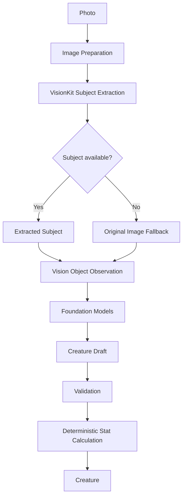

# Creature Generation

## Index

- [Purpose](#purpose)
- [Current Pipeline](#current-pipeline)
- [Pipeline Diagram](#pipeline-diagram)
- [Data Sources](#data-sources)
- [Validation](#validation)
- [Deterministic Rules](#deterministic-rules)
- [Current Limitations](#current-limitations)
- [Open Questions](#open-questions)

## Purpose

This document is the source of truth for how Snap Battle turns an image into a creature. It should be updated whenever the generation pipeline changes.

## Current Pipeline

1. A user image enters the pipeline.
2. The image is normalized and fingerprinted.
3. VisionKit attempts subject extraction.
4. If subject extraction fails or is unavailable, the original image is used as fallback.
5. Vision classifies the image and returns ranked labels with confidence values.
6. The app derives geometry and subject metadata.
7. The app infers a broad material from Vision labels using simple heuristics.
8. Foundation Models receives structured metadata, not direct image pixels.
9. Foundation Models returns a structured `CreatureDraft`.
10. The draft is validated for required fields, length, role, and tags.
11. Stats are calculated deterministically.
12. A final `Creature` is assembled.

## Pipeline Diagram

## Data Sources

| Data | Source | Type | Notes |
| --- | --- | --- | --- |
| Original size | Image preparation | Deterministic | Read from `CGImage`. |
| Processed size | Image preparation | Deterministic | After orientation normalization. |
| Fingerprint | Image preparation | Deterministic | SHA-256 over a normalized 32x32 pixel sample. |
| Extracted subject image | VisionKit | System analysis | Falls back to original image when unavailable. |
| Subject count | VisionKit | System analysis | Optional diagnostic value. |
| Labels | Vision | System analysis | Top image classification identifiers. |
| Label confidences | Vision | System analysis | Confidence values for ranked labels. |
| Aspect ratio | App rule | Deterministic | Derived from image geometry. |
| Subject pixel count | App rule | Deterministic | Derived from extracted subject image dimensions. |
| Transparency | App rule | Deterministic | Derived from subject image alpha information. |
| Material | App heuristic | Heuristic | Label keyword mapping, not a physical claim. |
| Name | Foundation Models | Creative | Must pass validation. |
| Role | Foundation Models | Creative constrained | Must be one of the allowed roles. |
| Temperament | Foundation Models | Creative | Must pass validation. |
| Description | Foundation Models | Creative | Must pass validation. |
| Tags | Foundation Models | Creative | Up to three validated tags. |
| Stats | Game rules | Deterministic | Calculated outside the model. |

## Validation

Current `CreatureDraft` validation:

| Field | Rule |
| --- | --- |
| Name | Required, trimmed, max 32 characters. |
| Role | Required and must match `guardian`, `striker`, `trickster`, or `channeler`. |
| Temperament | Required, trimmed, max 80 characters. |
| Description | Required, trimmed, max 180 characters. |
| Tags | Required, max 3 tags, each max 24 characters. |

Invalid drafts fail the pipeline with `AppError.invalidDraft`.

## Deterministic Rules

Stats are not generated by Foundation Models. The current stat calculator uses:

- Role-based stat weights.
- Material modifiers.
- A stable seed from normalized name, role, material, and sorted labels.
- Fixed stat budget.
- Minimum and maximum stat bounds.
- Remainder allocation based on fractional weights.

## Current Limitations

- Foundation Models does not inspect the actual image directly in the current pipeline.
- Material inference is a keyword heuristic over labels.
- Subject extraction confidence is currently unknown.
- Rarity is not implemented.
- Collection persistence is not implemented.
- Generated identity may vary if the model produces a different draft for the same metadata.

## Open Questions

- Should creature identity be reproducible from the same image?
- Should the image fingerprint influence identity, stats, rarity, or collection uniqueness?
- Should subject extraction failure affect rarity or quality?
- How should low-confidence Vision output be represented to the player?
- Should material inference become a richer taxonomy?
