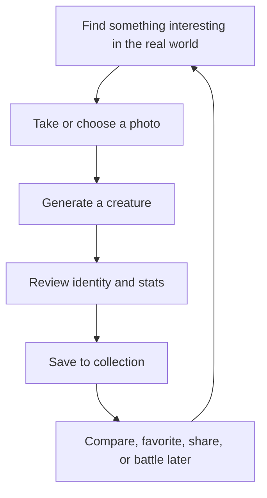

# Game Design

## Index

- [Vision](#vision)
- [Core Loop](#core-loop)
- [Creature Identity](#creature-identity)
- [Core Pillars](#core-pillars)
- [Decisions Taken](#decisions-taken)
- [Future Ideas](#future-ideas)
- [Open Questions](#open-questions)

## Vision

The player photographs objects from the real world. Those objects become original creatures with identity, personality, history, role, attributes, and a place in the player's collection.

Snap Battle should feel like discovering hidden characters in ordinary life. Combat can become important later, but the current design priority is discovery, creativity, collection, and personal connection.

## Core Loop

## Creature Identity

Each creature is expected to have:

- A short memorable name.
- A role.
- A temperament.
- A concise visual description.
- Visual tags.
- Material metadata.
- Deterministic stats.
- A connection to the extracted subject image.

## Core Pillars

| Pillar | Meaning |
| --- | --- |
| Wonder | Ordinary objects should feel newly alive. |
| Discovery | The player should want to try new photos. |
| Creativity | Generated creatures should feel surprising but explainable. |
| Collection | Creatures should be worth keeping, comparing, and organizing. |
| Personal Connection | The source object should matter to the player. |
| Physical World | The real environment is the starting point for play. |

## Decisions Taken

| Decision | Status |
| --- | --- |
| Creature generation starts from user photos. | Decided |
| The game should prioritize discovery and collection before combat. | Decided |
| Foundation Models should generate creative identity, not numeric stats. | Decided |
| Stats should be deterministic and controlled by game rules. | Decided |

## Future Ideas

Status: Exploration.

- Creature memory and history.
- Favorite creatures.
- Collection filters.
- Discovery badges.
- Photo location or context, only if privacy can be handled clearly.
- Creature families based on materials, shapes, or labels.

## Open Questions

- What makes one generated creature feel collectible long term?
- Should a creature remember the original source photo?
- Should the same photo always recreate the same creature identity, or only the same stat shape?
- How much should rarity matter?
- Should player edits be allowed after generation?
- What is the minimum collection feature set before combat starts?
